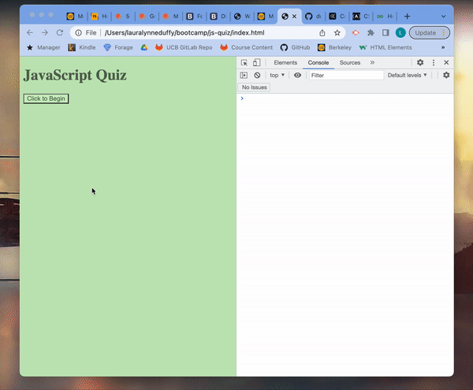

  # Javascript Quiz 

  
      
  ## Description 

  * This web application offers a timed  Javascript Quiz! Preparing for a coding assessment or a software developer interview? This is the app for you! 
  * This web app runs in the browser, and features dynamically updated HTML and CSS powered by JavaScript. 
    
  ## Table of Contents
  - [Installation](#installation)
  - [Usage](#usage)
  - [License](#license)
  - [Contributing](#contributing)
  - [Tests](#tests)
  - [Questions](#questions)

  ## Installation

  N/A

  ## Usage

  To use, click the "begin" button. You will then be presented with the first question. After you click on the button to select your first answer, you then be presented with the second question. This process will continue for five questions. 
  
  After you answer the final question, an alert will appear tell you your score and the amount of time you completed it in. Be careful -- You only have 60 seconds to complete the quiz and you loose ten seconds for every wrong answer! 

  
  
  You will then be prompted to enter your initials or name and your high score, the time you completed it in, and your initals/name will be saved to local storage and displayed below the end of the quiz in a dynamically generated "Previous Scores" section. 
    
  ## License

  This project is licensed under the terms of MIT license.

  For more information on this license, please visit [this link](https://opensource.org/licenses/MIT).
   
  ## Contributing 
  
  Interested in contributing!? There are many ways to contribute to this project. Get started [here](https://github.com/duffylaura/js-quiz).

  ## Tests 

  N/A
    
  ## Questions

  Please email lauraduffy700@gmail.com or contact me thgrough [GitHub](https://github.com/duffylaura/js-quiz).